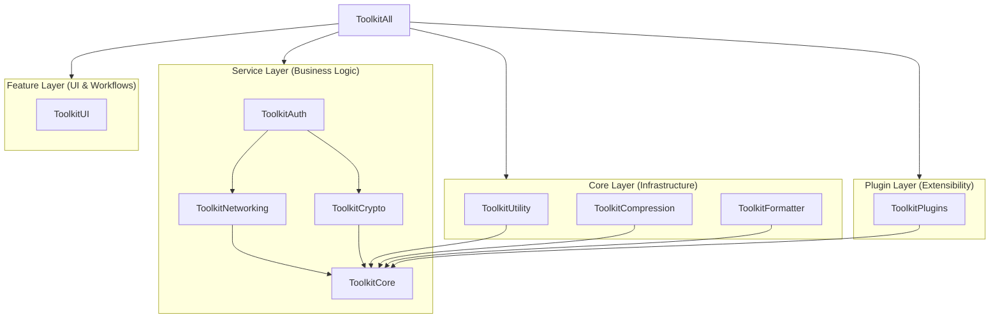

# Apple Platform Toolkit 🍎

[](https://swift.org)
[](https://developer.apple.com/ios/)
[](LICENSE)

A high-performance, modular, and enterprise-grade SDK for modern Apple platform development. Built with **Swift 6** concurrency at its core, this toolkit provides a unified, pluggable architecture for Authentication, Networking, Cryptography, and more.

---

## 🏗 Architecture Overview

The Apple Platform Toolkit follows a strict **4-layer architecture** to ensure maximum decoupling, testability, and scalability.



- **Core Layer**: Foundation utilities (Logging, DI, Task Management).
- **Service Layer**: High-level business logic (Networking, Auth).
- **Feature Layer**: Reusable UI components.
- **Plugin Layer**: Cross-cutting concerns (Analytics, Observability).

---

## 📦 Installation

Integrate the toolkit via **Swift Package Manager**. You can import the entire suite or individual modules to keep your binary size small.

```swift
dependencies: [
    .package(url: "https://github.com/anupamthackar/ApplePlatformToolkit.git", from: "1.0.0")
]

// In your Target:
.target(
    name: "YourApp",
    dependencies: [
        .product(name: "ToolkitAll", package: "MyToolkit"), // All modules
        // OR individual modules:
        .product(name: "ToolkitAuth", package: "MyToolkit"),
        .product(name: "ToolkitNetworking", package: "MyToolkit")
    ]
)
```

---

## 🛠 Module Deep Dive

### 1. ToolkitCore: The Foundation
The heartbeat of the SDK. Provides thread-safe infrastructure.

- **Dependency Injection**: Use `@Inject` for clean property-based DI.
- **Task Management**: Actor-based execution and cancellation.
- **Logging**: Level-based, asynchronous logging with metadata support.

```swift
import ToolkitCore

// Logging with Metadata
Logger.shared.addMetadata("user_id", value: "12345")
Logger.shared.log("Initializing Dashboard", level: .info)

// Dependency Injection
DependencyContainer.shared.register(ApiService.self) { MyApiService() }

struct DashboardView {
    @Inject var api: ApiService
}
```

---

### 2. ToolkitAuth: Identity & Sessions
Manages the user lifecycle and integrates deeply with the networking layer.

- **Auto-Adaptation**: Automatically injects Bearer tokens into `URLRequest`s.
- **Auto-Refresh**: Handles 401 errors by triggering token refresh and retrying.
- **Biometrics**: Native FaceID/TouchID integration hooks.

```swift
import ToolkitAuth

let auth = Toolkit.auth // Global access point

// Multi-method authentication
try await auth.authenticate(method: .biometric)

// State Observation
if auth.state == .authenticated {
    let token = auth.session.currentToken()
}
```

---

### 3. ToolkitNetworking: Resilient Communication
A robust wrapper around Alamofire/URLSession with enterprise resilience.

- **Request Builder**: Fluent API for complex requests.
- **Circuit Breaker**: Automatically stops requests to failing endpoints.
- **Interceptors**: Middleware for request/response modification.

```swift
import ToolkitNetworking

let request = NetworkRequestBuilder()
    .url("https://api.myapp.com/v1/profile")
    .method(.get)
    .retryCount(3)
    .cachePolicy(.useCacheIfAvailable)
    .build()

let profile = try await Toolkit.networking.execute(request, decoding: Profile.self)
```

---

### 4. ToolkitCrypto: Secure by Default
Abstraction over Apple's CryptoKit with support for strategy-based encryption.

- **Hashing**: Fluent `HashBuilder` for multi-stage hashing.
- **Encryption**: Pluggable strategies (AES, ChaChaPoly).
- **Key Management**: Secure storage and generation.

```swift
import ToolkitCrypto

// Secure Hashing
let hash = HashBuilder()
    .setAlgorithm(.sha256)
    .append(string: "secret_data")
    .applySalt(mySalt)
    .finalizeHex()

// Strategy-based Encryption
let strategy = ToolkitCryptoManager.shared.resolveStrategy(for: .chachaPoly)
let encrypted = try strategy.encrypt(payload, key: key, iv: iv)
```

---

### 5. ToolkitUtility: System Power-ups
A collection of 50+ utilities for hardware and system interaction.

- **Connectivity**: Real-time network quality and type monitoring.
- **Device Info**: Battery, thermal state, and memory stats.
- **Formatting**: High-performance pipeline-based string formatters.

```swift
import ToolkitUtility

// Connectivity Monitoring
let isFast = ToolkitUtilityManager.shared.connectivity.connectionQuality() > 0.7

// Formatting Pipeline
let cleanString = FormatPipelineBuilder()
    .trim()
    .uppercase()
    .replace("-", with: " ")
    .build()("  hello-world  ") // "HELLO WORLD"
```

---

### 6. ToolkitPlugins: Observability
A registry for cross-cutting concerns that need to hook into the SDK lifecycle.

```swift
import ToolkitPlugins

class AnalyticsPlugin: PluginProtocol {
    let id = "com.app.analytics"
    func onLoad() { /* Setup tracking */ }
    func onExecute() { /* Track app activity */ }
    func onUnload() { /* Cleanup */ }
}

PluginRegistry.shared.register(AnalyticsPlugin())
```

---

## 🧪 Testing Support

The Toolkit is designed for unit testing. Every manager has a corresponding protocol, and the DI container supports overrides.

```swift
func testLogin() async {
    let mockAuth = MockAuthManager()
    DependencyContainer.shared.override(ToolkitAuthManager.self, instance: mockAuth)
    
    // Now your app uses the mock automatically
    let viewModel = LoginViewModel()
    await viewModel.login()
    
    XCTAssertTrue(mockAuth.loginCalled)
}
```

---

## 📄 License
This project is licensed under the MIT License - see the [LICENSE](LICENSE) file for details.
