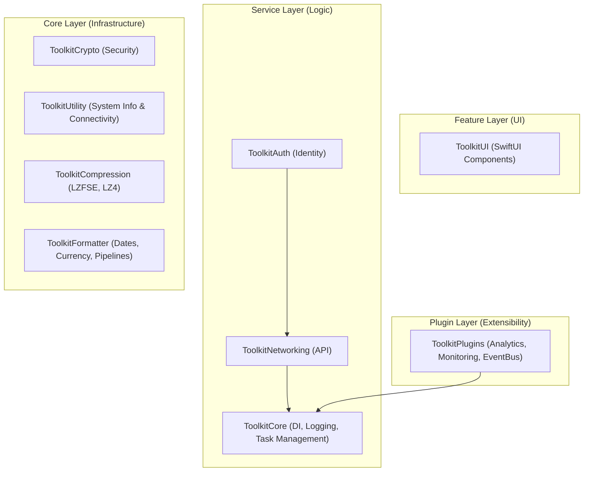

# Apple Platform Toolkit 🍎

[](https://swift.org)
[](https://developer.apple.com/ios/)
[](LICENSE)
[](#-architecture-overview)

**Apple Platform Toolkit** is an enterprise-grade, highly modular SDK designed to accelerate modern Swift development. Built from the ground up for **Swift 6 Concurrency**, it provides a rock-solid, decoupled foundation for high-performance applications.

> [!IMPORTANT]
> This toolkit is designed for both **Beginners** (using the `ToolkitAll` umbrella) and **Pros** (using individual, decoupled modules for granular control).

---

## 🏗 Architecture Overview

The toolkit follows a strict **4-layer architectural pattern**, ensuring maximum testability and scalability.

### Dependency Graph


---

## 📦 Module Reference

| Module | Responsibility | Key Features |
| :--- | :--- | :--- |
| **`ToolkitCore`** | Foundation | DI Container, Async Logger, Task Manager, Lifecycle Management. |
| **`ToolkitNetworking`** | Communication | URLSession wrapper, Interceptors, Circuit Breaker, Auto-Retry. |
| **`ToolkitAuth`** | Identity | Session management, OAuth2, Biometrics, Token Auto-Adaptation. |
| **`ToolkitCrypto`** | Security | AES-GCM, ChaChaPoly, PBKDF2, Secure Hashing, Key Management. |
| **`ToolkitCompression`** | Performance | LZFSE, LZ4, ZLIB, Batch & Streaming compression, CRC32. |
| **`ToolkitUtility`** | System | Reachability, Device Hardware Stats, Watch Connectivity. |
| **`ToolkitFormatter`** | Transformation | ISO8601, Currency, Abbreviated Numbers, String Pipelines. |
| **`ToolkitUI`** | Interface | Global Themes, HUD/Toasts, Pre-built Login & Settings views. |
| **`ToolkitPlugins`** | Observability | Plugin Registry, EventBus (Pub/Sub), Context-aware execution. |
| **`ToolkitAll`** | Umbrella | Imports and exports all of the above in one statement. |

---

## 🚀 Quick Start

### 1. Installation
Add via **Swift Package Manager** in Xcode (File > Add Packages...):
`https://github.com/anupamthackar/ApplePlatformToolkit.git`

### 2. Basic Setup
```swift
import ToolkitAll

// Standard logging
Toolkit.core.logger.log("App Started", level: .info)

// Perform an API request
let result = try await Toolkit.networking.execute(request, decoding: User.self)
```

---

## 🛠 Advanced Usage (For Pros)

### 💉 Dependency Injection
Decouple your features using our thread-safe container:
```swift
// Register
DependencyContainer.shared.register(ApiService.self) { RealApiService() }

// Inject
struct ProfileView {
    @Inject var api: ApiService
}
```

### 🔐 Secure Encryption
High-level abstractions over `CryptoKit`:
```swift
let crypto = Toolkit.crypto
let key = crypto.generateKey()
let encrypted = try await crypto.encrypt(myData, key: key)
```

### 🛰 Plugin System & EventBus
Extend the SDK without modifying it:
```swift
// Listen for events
EventBus.shared.subscribe(event: "login_success") { event in
    Analytics.track(event.name)
}

// Register a plugin
try PluginManager.shared.register(MyCustomPlugin())
```

---

## 📄 Release & Documentation
- **API Documentation**: Every public method, class, and property is documented with `///` for **Xcode Quick Help** support.
- **Next Release**: Includes the full documentation overhaul, enhanced compression streaming, and the new EventBus system.

---

## 🤝 Contributing
Contributions are what make the open-source community an amazing place to learn, inspire, and create. Any contributions you make are **greatly appreciated**.

---

## 📄 License
Distributed under the **MIT License**. See `LICENSE` for more information.

<p align="center">
  Made with ❤️ for the Apple Developer Community
</p>
