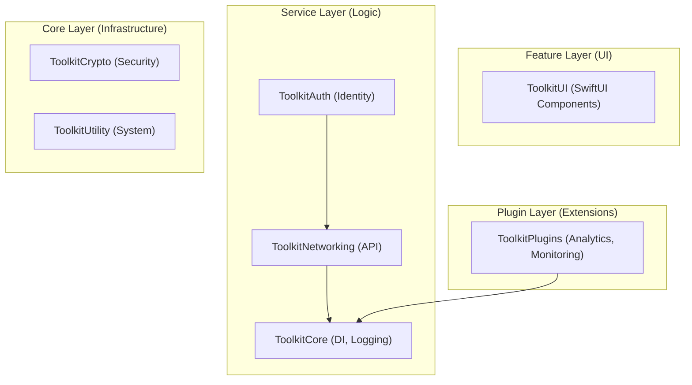

# Apple Platform Toolkit 🍎

[](https://swift.org)
[](https://developer.apple.com/ios/)
[](LICENSE)
[](#-architecture-overview)

**Apple Platform Toolkit** is a production-grade, modular SDK designed to accelerate modern Swift development. Built from the ground up with **Swift 6 Concurrency**, it provides a rock-solid foundation for enterprise applications, handling everything from resilient networking to secure authentication with ease.

> [!TIP]
> **New to the toolkit?** Start with the [Quick Start](#-quick-start) section. **Building an enterprise app?** Check out our [Professional Architecture](#-professional-architecture) guide.

---

## ✨ Key Features

- **🛡 Swift 6 Native**: Built-in data race safety and modern concurrency patterns.
- **🧩 100% Modular**: Import only what you need (Auth, Networking, Crypto, etc.).
- **🏗 Layered Architecture**: Strict separation of concerns (Core, Service, Feature, Plugin).
- **💉 Built-in DI**: Elegant dependency injection with the `@Inject` property wrapper.
- **🌐 Resilient Networking**: Advanced retry logic, circuit breakers, and automatic token refresh.
- **🎨 UI Ready**: Pre-built, customizable SwiftUI components.

---

## 🚀 Quick Start

### 1. Installation
Add the toolkit to your project via **Swift Package Manager**:

1. In Xcode, go to **File > Add Packages...**
2. Paste the repository URL: `https://github.com/anupamthackar/ApplePlatformToolkit.git`
3. Select the modules you need:
   - `ToolkitAll`: The complete suite (Recommended for beginners).
   - `ToolkitNetworking`: Just the network layer.
   - `ToolkitAuth`: Identity and session management.

### 2. Basic Usage
Here is how you can perform a simple network request and log the result:

```swift
import ToolkitAll

// 1. Initialize a request
let request = NetworkRequestBuilder()
    .url("https://api.example.com/v1/profile")
    .method(.get)
    .build()

// 2. Execute with modern concurrency
Task {
    do {
        let profile = try await Toolkit.networking.execute(request, decoding: UserProfile.self)
        Logger.shared.log("Profile loaded: \(profile.name)", level: .info)
    } catch {
        Logger.shared.log("Failed to load profile: \(error)", level: .error)
    }
}
```

---

## 🏗 Professional Architecture

For pro developers, the toolkit enforces a **4-layer architecture** to ensure your codebase remains maintainable as it scales.

### Architectural Diagram


### Advanced: Dependency Injection
Decouple your code using our lightweight DI container:

```swift
// Register a service
DependencyContainer.shared.register(StorageService.self) { KeychainStorage() }

// Inject it anywhere
class ProfileViewModel: ObservableObject {
    @Inject private var storage: StorageService
    
    func saveToken(_ token: String) {
        storage.save(token, for: "auth_token")
    }
}
```

---

## 📦 Module Explorer

| Module | Description | Best For |
| :--- | :--- | :--- |
| **`ToolkitCore`** | DI, Logging, Task Management | Foundation of every app. |
| **`ToolkitNetworking`** | Resilient API communication | Apps consuming REST/GraphQL. |
| **`ToolkitAuth`** | Session, JWT, Biometrics | User-facing apps with logins. |
| **`ToolkitCrypto`** | AES, ChaChaPoly, Hashing | Apps handling sensitive data. |
| **`ToolkitUI`** | Modular SwiftUI views | Rapid UI prototyping. |
| **`ToolkitPlugins`** | Lifecycle hooks & Analytics | Observability and extensibility. |

---

## 🛡 Security & Concurrency

- **Thread Safety**: Every manager is an `Actor` or `@MainActor` isolated, preventing data races by design.
- **Encryption**: Uses Apple's `CryptoKit` with high-level abstractions for common tasks like hashing and symmetric encryption.
- **JWT Handling**: Native support for secure token storage in the iOS Keychain via `ToolkitAuth`.

---

## 🤝 Contributing

We welcome contributions! Whether you're fixing a bug or adding a new feature:
1. Fork the repo.
2. Create your feature branch (`git checkout -b feature/AmazingFeature`).
3. Commit your changes (`git commit -m 'Add AmazingFeature'`).
4. Push to the branch (`push origin feature/AmazingFeature`).
5. Open a Pull Request.

---

## 📄 License

Distributed under the **MIT License**. See `LICENSE` for more information.

---

<p align="center">
  Made with ❤️ for the Apple Developer Community
</p>
